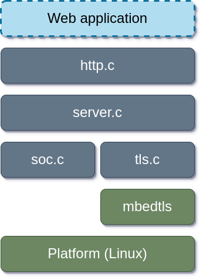

## Description

Simple HTTP server written on pure C. Able to provide access to static pages and files.
The solution contains following files/modules:

| File/module name | Description |
| :--- | :--- |
| main.c | Responcible for parsing user specefied arguments and starts the server with the speceied arguments |
| config.h | Contain options available for coniguration while compile time (see **Build** section) |
| server | Represents server abstraction that able to create new connections and pass raw data to upper layer |
| soc | The module implements TCP communucation based on sockets |
| tls | The module implements secure TCP communication with TLS implementstion based on **mbedtls** library |
| http | Responsible for handling HTTP requests |
| log.h | Provides logging functionality |

## Build

Makefile used as build tool, so to build the solution juts:
```bash
$ make
```

Be aware that **config.h** contain some usefull options that might be changed before compilation.
The following options are available:

| Option | Description |
| :--- | :--- |
| CONFIG_KEEPALIVE_ENABLE | Enable support of keep-alive feature |
| CONFIG_KEEPALIVE_TIMEOUT_SEC | Define timeout for keep-alive in seconds |
| CONFIG_INPUT_BUFF_LEN | Define size of buffer for input (from client to server) data in bytes |
| CONFIG_OUTPUT_BUFF_LEN | Define size of buffer for output (rom server to client) data in bytes |
| CONFIG_MAX_PATH_SIZE | Define maxinum path size in HTTP request |

## Install

Just copy output binary (by default it is **server** file) to some $PATH folder by you own :)

## Usage

Following arguments/options are available to pass it to the server:
| Name | Default | Description |
| :--- | :---: | :--- |
|--root (-r) | $PWD | Root folder that would contais your server resources |
| --addr (-a) | 127.0.0.1 | IP Address of your server |
| --port (-p) | 80 | Your server TCP port |
| -s | false | This flag enables secure connection over TLS which implements HTTPS communication |
| --help (-h) | NA | Provides you some usefull information |
| --version | NA | Provides you version of the solution |

You may run the server as it is (most probabyl you would require supeuser rights, so do not forget about sudo :)) without any additional arguments, like:
```bash
$ sudo server
```
In that case the solution will by launched with deault options.
Or you may specify your own options, like:
```bash
$ sudo server --root ~/my_server --addr 192.160.0.199 --port 443 -s
```

## Known issues and limitations

 - Keep-alive works not really fine :)
 - Chunked transfer encoding is not supported
 - Does not work with clients that send each keystroke immediatelly (like putty)
 - HTTPS implemented with test certiicates from mbedtls libraries. So browsers may rude on.
